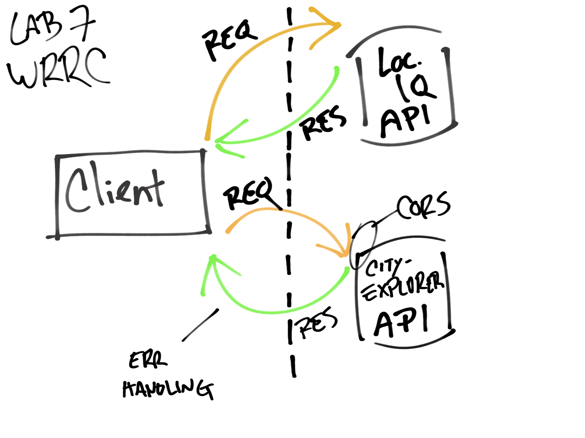

# Filename: city-explorer-api-82

## Lab - Class 07 - Custom Servers with Node and Express

**Author**: Rey Mercado
**Version**: 1.0.0 (increment the patch/fix version number if you make more commits past your first submission)

## Overview

In this lab assignment, I will begin building my own custom API server, which will provide data for the City Explorer front-end application. This means users will get to see not only the map, but also interesting information about the area, provided by a variety of third-party APIs that my server will manage.

Convert the `README.md` file to be documentation regarding your lab and its current state of development. Check the "documentation" section of the lab assignment for more details on how that should look AT MINIMUM.

<!-- Provide a high level overview of what this application is and why you are building it, beyond the fact that it's an assignment for this class. (i.e. What's your problem domain?) -->

Provide a high level overview of what this application is and why you are building it, beyond the fact that it's an assignment for this class. (i.e. What's your problem domain?)

## Getting Started
<!-- What are the steps that a user must take in order to build this app on their own machine and get it running? -->

What are the steps that a user must take in order to build this app on their own machine and get it running?

## Process

For every lab in this module, you will have a new partner. You and your new partner(s) will spend the first 30 minutes reviewing each other’s code from the previous lab and planning out an approach to this lab’s work on a whiteboard.

Do a formal code review of each person’s code (10 minutes each).
Open your partner’s GitHub pull request on your laptop.
Identify an area in the code that:
you don’t understand
or seems overly complex
or you see a way to improve
or you want more information on
or you really like or think is interesting
Add kind comments or questions inline using the GitHub review feature.
Draw the web request-response cycle for the current lab tasks (about 10 minutes).
Document the data flow: identify inputs and outputs for each part of the cycle.
Outline the functions that support this data flow.
Be sure to include these drawings in your README.md.
You will then work independently for the rest of the day, implementing your plan, coding in your own repository, submitting your own pull request.

## Draw the web request-response cycle for the current lab tasks (about 15 minutes).

Document the data flow: identify inputs and outputs for each part of the cycle.
Outline the functions that support this data flow.
Be sure to include these drawings in your README.md.
You will then work independently for the rest of the day, implementing your plan, coding in your own repository, submitting your own pull request.

## Whiteboard visualization / group work

Drawing collaborated with group partner Micha Davis

## Netlify App URL

(https://gallant-engelbart-d8b680.netlify.app/)

## Trello board url

(https://trello.com/b/xGlz6ikd/city-explorer-301d82)

## Architecture

Provide a detailed description of the application design. What technologies (languages, libraries, etc) you're using, and any other relevant design information.
<!-- Provide a detailed description of the application design. What technologies (languages, libraries, etc) you're using, and any other relevant design information. -->

## Change Log

Use this area to document the iterative changes made to your application as each feature is successfully implemented. Use time stamps. Here's an example:

01-01-2001 4:59pm - Application now has a fully-functional express server, with a GET route for the location resource.

<!-- Use this area to document the iterative changes made to your application as each feature is successfully implemented. Use time stamps. Here's an example:

01-01-2001 4:59pm - Application now has a fully-functional express server, with a GET route for the location resource. -->

## Credit and Collaborations
<!-- Give credit (and a link) to other people or resources that helped you build this application. -->
Time Estimates
For each of the lab features, make an estimate of the time it will take you to complete the feature, and record your start and finish times for that feature:

Name of feature: ________________________________

Estimate of time needed to complete: _____

Start time: _____

Finish time: _____

Actual time needed to complete: _____
Name of feature: Create a new repo called `city-explorer-api` on GitHub, initialized with a README file. Clone it locally, and do all your work on a meaningfully-named feature branch off of `main`.

Estimate of time needed to complete: _____

Start time: _____

Finish time: _____

Actual time needed to complete: _____
Name of feature: Run the command `npm init` to create a new project. Answer the prompts with reasonable answers, or just hit enter to accept the defaults. Review the `package.json` file that it creates for you, and edit it if desired.

Estimate of time needed to complete: _____

Start time: _____

Finish time: _____

Actual time needed to complete: _____
Name of feature: Use `npm install` to add the required dependencies to this project: `express`, `dotenv`, and `cors`.

Estimate of time needed to complete: _1hr____

Start time: _3:42p____
Break time: 4:29
Continue time: 4:31p
Break time: 6pm
Continue time: 11:15pm
Finish time: _11:30p____

Actual time needed to complete: 47 + 89 +15 = 151 min= _2hrs 31 min____
Name of feature: Manually add the remaining files identified in the folder tree above. Put appropriate content into `.gitignore` and `.eslintrc.json`.

Estimate of time needed to complete: _____

Start time: _____

Finish time: _____

Actual time needed to complete: _____
Name of feature: Copy the contents of [weather.json](https://codefellows.github.io/code-301-guide/curriculum/class-07/lab/starter-code/data/weather.json) and paste it into your (otherwise empty) local `/data/weather.json`. 

Estimate of time needed to complete: _____

Start time: _____

Finish time: _____

Actual time needed to complete: _____
Name of feature: Set the contents of .env to set a value for `PORT`. Ensure `.env` is in your `.gitignore` file.

Estimate of time needed to complete: _____

Start time: _____

Finish time: _____

Actual time needed to complete: _____
Name of feature: Populate your `README.md` file with the template provided in the lab. Fill in what you can at this point, and the rest before you submit your finalized assignment.

Estimate of time needed to complete: _____

Start time: _____

Finish time: _____

Actual time needed to complete: _____
